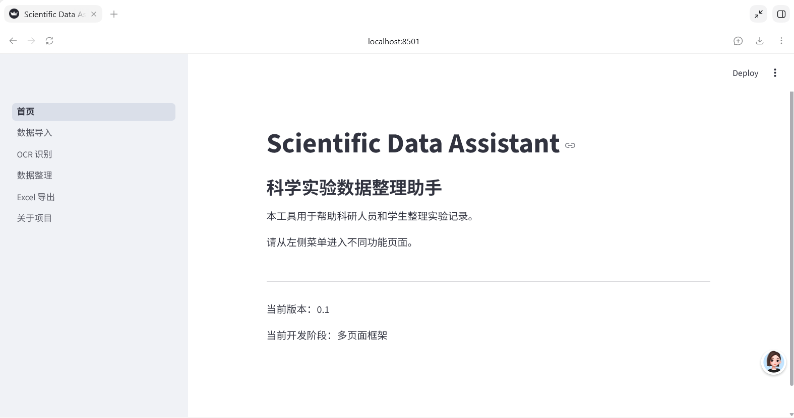
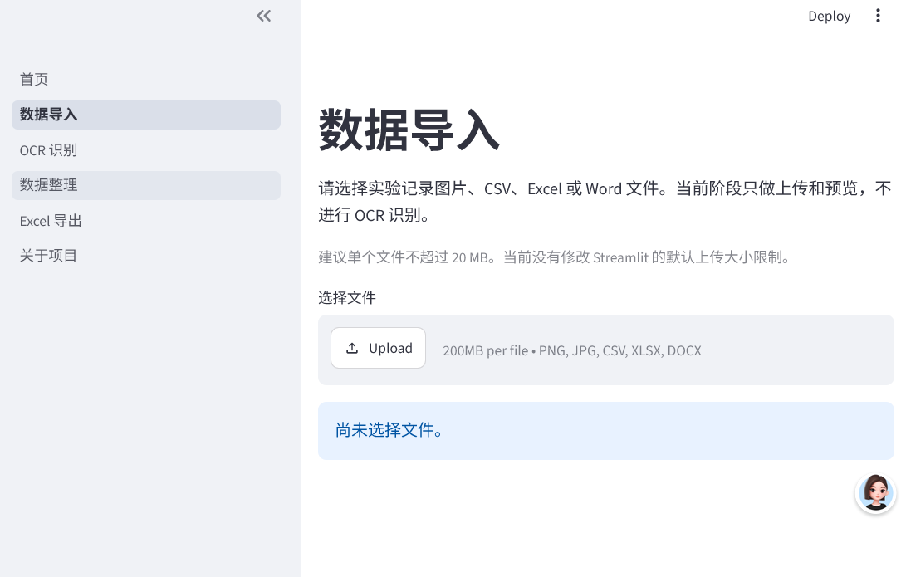
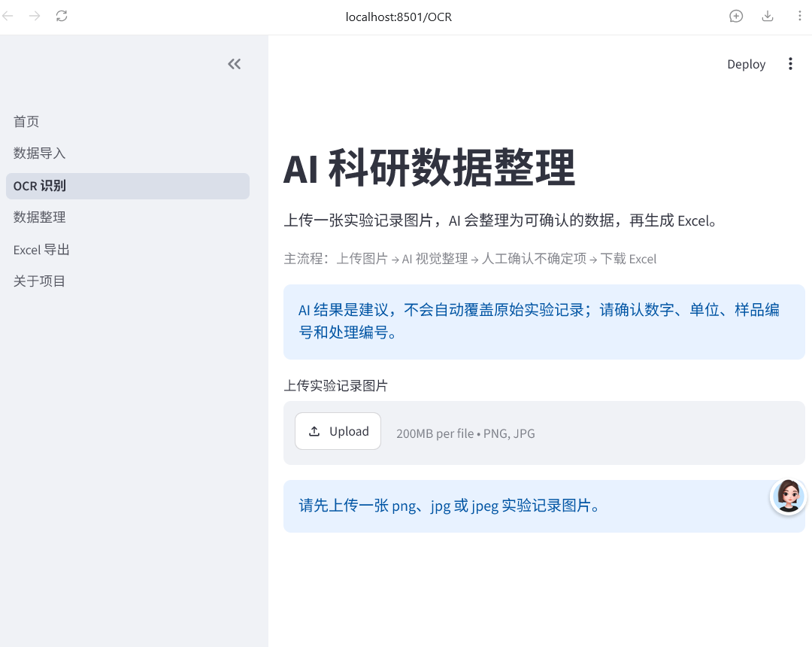

# AI Scientific Data Assistant

> v0.2.2.3 · 面向科研实验记录的 AI 结构化提取、独立校验、人工确认与 Excel 导出工具

AI Scientific Data Assistant（AI 科研数据整理助手）尝试解决一个具体问题：把实验记录图片、Word 文档和半成品表格整理成可检查的结构化数据。

项目的重点不是用 AI 代替科研人员，也不是把模型输出直接当作实验事实，而是建立一条可追溯的工作流：保留图片观察结果，分离 AI 建议，由用户确认最终数据，再导出 Excel。

## 项目简介

AI Scientific Data Assistant 是一个面向科研实验记录整理的辅助工具。用户可以上传实验图片、Word、Excel 或 CSV 文件；系统帮助提取和整理实验记录、提示可疑数据，并在人工确认后导出 Excel。

它的定位是减少科研数据整理中的重复录入与核对工作，而不是替代研究人员判断。模型识别结果、AI 建议与用户最终确认结果始终分开保存。

## 当前功能

- 图片与实验记录文件上传、预览；
- AI 视觉数据提取与结构化表格生成；
- Extraction 字段名称轻量规范化，不改写原始单元格内容；
- 独立 Validation 数据检查，包括缺失、模糊字符和可定位异常提示；
- 实验编号结构检查：提示疑似缺少 `/`、片段粘连、`|` 替代 `/` 或 `1/I/l` 分隔符混淆；
- 重复测量压缩检查：提示一个测量单元格中可能压缩了多个数值；
- Review 人工确认：保留原始值、采用 AI 建议或手动修改；
- 导出包含整理后数据、字段说明和识别记录的 Excel 文件。

## 数据可靠性设计

```text
Extraction（图片中的原始观察）
        ↓
Validation（只发现问题，不修改原始数据）
        ↓
Review（用户确认、保留或手动修改）
        ↓
Excel（导出最终确认结果与追溯信息）
```

对于编号模糊、特殊字符不确定或测量值异常，系统只生成提醒或建议，不能自动覆盖科研原始观察值。是否采用建议始终由用户决定。

## 测试情况

项目提供离线单元测试与真实图片 Benchmark 工具。最近一轮 10 张真实科研图片回归测试中：Extraction、Validation 和 Excel 生成均为 10/10 成功；实验编号结构检查对先前记录的 74 条异常模式全部命中，规范编号样式未出现规则级误报。该结果仅用于当前样本的工程回归验证，不代表通用识别准确率。

## 在线 Demo

[打开 AI Scientific Data Assistant 在线 Demo](https://ai-scientific-data-assistant-ahejfrqnxnjbs7olako2ju.streamlit.app/Data_Upload)

在线 Demo 用于功能测试，不附带免费模型调用额度。使用真实视觉模型时，需要配置自己的 API Key。`localhost:8501` 仅用于本地开发。

## Demo 截图

### 项目首页



### 数据导入

支持实验记录图片、CSV、Excel 和 Word 文件的上传与预览。



### AI 科研数据整理

上传实验记录图片后，可进入结构化识别、人工确认和 Excel 导出流程。



## Project Motivation｜项目动机

真实科研记录往往不是整洁的数据表：它们可能来自手机拍摄的手写记录、Word 实验日志，或列名和单位尚未整理好的 Excel 文件。人工录入不仅耗时，还容易在样品编号、小数点、正负号、单位和重复实验关系上产生错误。

通用 OCR 可以识别字符，却不一定理解“哪一列是处理编号”“哪些行属于重复测量”“哪个模糊字符需要人工确认”。因此，本项目把问题定义为科研数据整理，而不是单纯 OCR：

```text
非结构化实验记录
        ↓
AI 提取图片中可见的实验数据
        ↓
保留不确定信息并由用户确认
        ↓
生成可追溯的 Excel
```

数据安全原则：

- `observed_value`：图片中直接观察到的内容。
- `suggested_value`：AI 根据上下文提出的候选建议。
- `final_value`：用户确认后用于最终结果的内容。
- AI 建议不能自动覆盖原始观察值。
- 缺失、模糊或无法确认的数据不得伪装成真实测量数据。

## 当前支持功能

- Streamlit 多页面网页界面。
- 上传与预览 PNG、JPG、JPEG、CSV、XLSX、DOCX 文件。
- EasyOCR 本地基础文字识别与人工校对，作为备用模式。
- 基于火山引擎 Ark 的 Doubao Vision 单图科研记录识别。
- v0.2.1.2 默认使用精简 Extraction 模式提取结构化观察数据。
- 保留 legacy 识别模式作为开发回退方案。
- 对 Extraction 结果运行独立 Validation，不重新识别图片、不修改原始观察数据。
- Validation 支持 Mock 测试模式和真实 Doubao Provider，失败时不会阻断主流程。
- Validation findings 按 high、medium、low 分级，并在展示前进行去重、定位优先排序和数量限制。
- ValidationRunLog 记录模型、耗时、成功状态、错误类别和经过密钥遮蔽的原始响应。
- 原始观察值、AI 建议值和用户最终确认值的来源区分。
- 不确定项人工处理：保留原始识别、采用建议或手动修改。
- 导出包含“整理后数据”“字段说明”“识别记录”的 XLSX 文件。
- 面向已验证的横向四栏大图，提供实验性的旋正、区域切分和局部编号—数值对识别流程。

## Development Journey｜开发历程

### v0.1：MVP 完整闭环

第一版先验证最小产品流程：图片上传 → 视觉模型识别 → 结构化表格 → 人工确认 → Excel。项目同时建立了与平台无关的 `core/`、统一 `VisionProvider` 接口和 Streamlit 展示层。

### 真实图片测试暴露的问题

在普通表格、小样品编号和重复实验场景中，流程能够工作；但对复杂图片进行 benchmark 后发现：

- 长 JSON 可能以 `finish_reason=length` 结束，造成解析失败。
- 详细的不确定项、建议、依据和置信度与全部数据行同时输出，会显著放大响应。
- API 调用约占总耗时的绝大部分，本地预处理和 Python 解析不是主要性能瓶颈。
- 密集横向手写记录可以理解布局，但逐个数字的精确读取仍不稳定。

### Benchmark 驱动的调整

项目没有通过无限重试掩盖问题，而是记录响应长度、结束原因、token 用量和 API 耗时，并比较 legacy 与最小输出 Prompt。实验显示：减少首轮输出字段后，历史截断图片可以返回完整 JSON。

### v0.2.1：Extraction 架构升级

当前默认流程已切换到阶段1 Extraction：模型只负责提取 `columns`、`observed_rows`、重复关系和简短警告。旧 legacy 模式仍保留。Provider 还增加了单次 180 秒超时保护和可理解的错误分类。

### v0.2.2：独立 Validation

第二阶段不再把异常检查塞回图片提取 Prompt，而是只接收 Extraction 已生成的结构化数据。Validation 有独立的数据结构、Provider、Prompt 和 Session State；即使模型校验失败，用户仍可继续检查 Extraction 表格并导出 Excel。

当前已接通 Mock Validation 和真实 Doubao Validation。它们只返回 warnings、suggestions 和 uncertain_items，不重新查看图片，也不允许修改或补造原始实验数据。

### v0.2.2.3：Validation Reliability

真实测试曾出现 12 行数据产生 24 条 warning、0 条 suggestion 和 1 条 uncertain item；同一输入复测时数量又明显变化。这说明“API 调用成功”不等于 finding 稳定可靠。

因此项目增加了：

- ValidationRunLog，用于记录调用耗时、模型、响应状态和安全原始响应；
- severity、confidence 和 location_status，区分影响程度、模型确信程度和定位状态；
- Quality Filter，在不删除原始 findings 的前提下去重、排序和限制中低优先级数量；
- 原始 ValidationResult 与页面展示结果分离；
- high findings 全部保留，低风险项折叠展示。

这些机制改善的是可观测性和用户阅读体验，不代表模型判断一定正确。

## System Architecture｜系统架构

```text
Streamlit 页面（上传、展示、人工确认）
                    │
                    ▼
        平台无关的核心处理流程 core/
                    │
                    ▼
          统一 VisionProvider 接口
                    │
                    ▼
       DoubaoProvider（当前真实实现）
                    │
                    ▼
阶段1 Extraction：图片 → columns + observed_rows
                    │
                    ▼
        ExperimentResult（原始观察数据）
                    │
          ┌─────────┴─────────┐
          ▼                   ▼
   人工确认主流程      阶段2 Validation（可选）
                          │
              warnings / suggestions /
                  uncertain_items
                          │
                          ▼
                   Quality Filter
             去重 / 分级 / 排序 / 限量
          └─────────┬─────────┘
                    ▼
            用户人工检查与确认
                    │
                    ▼
                   Excel
```

架构边界：

- Validation 只检查 Extraction 结果，不修改 `ExperimentResult`。
- Validation 是可选步骤，失败不会阻断人工确认和 Excel 导出。
- Quality Filter 只生成展示副本；重复或受限 findings 仍然保留。
- severity 和 confidence 只帮助排序与判断，不能授权 AI 自动修改数据。

目录职责：

```text
app.py       Streamlit 启动入口
pages/       页面与用户交互
core/        数据模型、确认服务、Excel 导出、图像预处理
providers/   统一 VisionProvider 接口与模型实现
prompts/     Extraction、legacy 和实验性提示词
tests/       单元测试、回归测试与临时研究脚本
docs/        架构设计、benchmark 和实验报告
```

Validation 相关模块：

```text
core/validation_service.py       独立校验编排与 Extraction 只读保护
core/validation_schemas.py       ValidationResult、finding 与运行日志
core/validation_quality.py       finding 去重、排序和数量限制
providers/*validation*           Mock 与真实 Validation Provider
prompts/validation_prompt.py     只检查结构化数据的 Prompt
utils/validation_ui.py           独立状态、失败降级与分级展示
```

网页、未来命令行工具或其他 AI 平台适配层可以复用同一套核心流程。DoubaoProvider 是当前首个真实模型实现，不代表项目绑定某一家平台。

## Benchmark Results｜基准测试

测试对象为同一组 10 张真实科研图片。结果用于定位工程问题，不等同于通用模型准确率，也不代表所有图片都能达到相同表现。

| 指标 | 历史 Legacy 基线 | 本轮 Legacy | Extraction 原始结果 |
|---|---:|---:|---:|
| JSON 成功 | 8/10 | 10/10 | 10/10 |
| `finish_reason=length` | 2 | 0 | 0 |
| 平均总耗时 | 84.37 秒 | 119.75 秒 | 97.52 秒 |
| 平均输出长度 | — | 约 6,344 字符 | 约 4,358 字符 |

观察结果：

- Extraction 在本轮测试中把平均输出长度降低约 31.3%。
- 两张历史截断图片在 Extraction 下均完整返回，10 次响应均为 `finish_reason=stop`。
- Extraction 的原始平均耗时比同轮 Legacy 少约 22.23 秒，但其中一张图片等待约 416 秒，说明网络或模型响应仍可能出现长尾延迟。
- 按当前正式的单次 180 秒超时策略评估，该轮 Extraction 有效完成 9/10；超时保护提升了可控性，但不会提高模型本身的响应速度。
- 本轮 Legacy 也取得 10/10，说明模型输出存在随机波动。现有样本量不足以断言截断问题已经永久解决。
- 不同行数结果仍需结合人工标注判断，JSON 完整不等于识别内容完全正确。

完整实验记录见 [`docs/v0.2.1_extraction_full_benchmark_report.md`](docs/v0.2.1_extraction_full_benchmark_report.md) 和 [`docs/v0.2.1_integration_report.md`](docs/v0.2.1_integration_report.md)。

### Validation 质量观察

当前 Validation 只完成小样本工程验证，尚未建立足够规模的人工标注准确率数据。

| 测试观察 | 结果 |
|---|---:|
| 单张真实图片 Extraction 行数 | 12 |
| 一次 Validation warnings | 24 |
| 一次 Validation suggestions | 0 |
| 一次 Validation uncertain_items | 1 |
| 同图复测是否出现数量波动 | 是 |

这组数据推动了 Reliability Layer 的设计，但不能用于推断通用准确率。Quality Filter 可以减少重复和低价值展示，却不能证明保留下来的 finding 一定正确。

## 安装

当前开发环境为 Windows + Python 3.14。在项目根目录打开 PowerShell：

```powershell
python -m venv .venv
.\.venv\Scripts\python -m pip install -r requirements.txt
```

## 模型配置

本项目不提供免费的模型调用额度。用户需要配置自己的 API Key，并自行承担模型服务可能产生的费用。

配置读取优先级：

1. “AI 模型设置”网页中的当前会话配置。
2. 本地 `.env` 或环境变量。
3. Streamlit Cloud Secrets。

网页输入的 API Key 只保存在当前 Streamlit 会话内，不写入数据库、项目文件或 Git。

### 在线 Demo

打开左侧菜单中的“AI 模型设置”，填写 API Key、Model ID 和 Base URL，然后返回“OCR 识别”页面。

### 本地开发

复制 `.env.example` 为 `.env`，再填写自己的配置：

```powershell
Copy-Item .env.example .env
```

```text
ARK_API_KEY=<YOUR_ARK_API_KEY>
ARK_MODEL=<YOUR_ARK_MODEL_ID>
ARK_BASE_URL=https://ark.cn-beijing.volces.com/api/v3
```

不要提交 `.env`，也不要在代码、截图或 Issue 中公开密钥。

## 本地运行

```powershell
.\.venv\Scripts\python -m streamlit run app.py
```

本地开发时打开 <http://localhost:8501>。普通用户可以直接使用上方在线 Demo，无需访问本地地址。

## 使用说明

1. 打开在线 Demo，或在本地启动 Streamlit。
2. 在“AI 模型设置”中填写自己的 API Key、Model ID 和 Base URL。
3. 打开“OCR 识别”，上传一张 PNG、JPG 或 JPEG 实验记录图片。
4. 点击“开始 AI 科研数据整理”，等待结构化提取完成。
5. 对照原图检查 Extraction 表格和不确定内容。
6. 如需进一步检查，可点击“运行 AI 数据检查”。该步骤会增加一次模型调用、等待时间和可能的费用。
7. 查看高、中、低风险 findings。Validation 结果只是辅助提示，仍需人工判断。
8. 保留原始识别、采用合适的 AI 建议，或手动输入最终值。
9. 生成并下载 Excel。

对于已验证的 80 样品横向四栏图片，可在高级设置中手动启用大图四栏预处理。该流程仍处于实验阶段，不适用于任意版式。

## Roadmap｜后续路线

- **Validation 定位增强**：验证 finding 行号与字段绑定，并为无法定位的项目提供可追踪原因。
- **Validation 质量评估**：建立脱敏人工标注集，统计有效发现率、误报率和跨次复现率。
- **Anomaly Detection**：检查缺失值、重复记录、格式异常和明显异常值，所有判断均需可追溯。
- **Variable Ordering**：允许用户定义实验变量层级与组合顺序。
- **Unit Recognition**：识别图片中明确出现的单位，对缺失或推测单位单独标记并等待确认。

上述功能尚未完成，不包含自动统计推断、自动填补实验数据或无需人工检查的承诺。

## 当前限制

- 手写、模糊、倾斜和高密度多栏记录仍可能出现字符或行对应错误。
- 样品编号、小数字、正负号、单位和特殊符号尤其需要人工检查。
- Extraction 与 Validation 已分为两个独立阶段；Validation 需要用户主动运行，并会产生额外模型调用。
- Validation 只检查结构化结果，不重新查看图片，无法自行确认图片中的模糊字符。
- Validation findings 存在随机波动，同一输入多次运行可能得到不同结果。
- severity 和 confidence 是辅助信息，不代表 finding 已被证实。
- Quality Filter 只优化展示，不提高模型本身的科研判断准确率。
- 部分 finding 的行列位置仍可能处于“尚未验证”或“无法定位”状态。
- Validation 日志当前存在于运行内存，不是长期审计数据库。
- Validation 建议不会自动写入 final_value 或 Excel 主数据表。
- API 调用速度取决于网络、模型服务和图片复杂度，单张图片可能需要几十秒。
- 大图四栏预处理仅针对已验证版式，不是通用文档布局识别器。
- 当前没有账户、数据库、支付、正式多用户部署或多模型自动路由。
- 真实图片 benchmark 样本量仍较小，需要更多人工标注数据评估识别准确率。

## 测试

不依赖真实 API 的最小语法检查：

```powershell
.\.venv\Scripts\python -m compileall core providers prompts pages
```

真实 API 测试可能产生费用。真实实验图片、本地调试裁剪图和 API 配置不属于开源仓库内容。

## 主要依赖

主要依赖包括 Streamlit、pandas、openpyxl、python-docx、EasyOCR、OpenAI Python SDK、python-dotenv、NumPy 和 Pillow。完整列表见 [requirements.txt](requirements.txt)。使用或发布前，请根据实际锁定版本核对第三方许可证与兼容性。

## 隐私与数据安全

- 本地上传文件只在当前运行期间处理，不写入项目目录。
- 使用 Doubao Vision 时，图片会发送到用户配置的模型服务，请自行确认其隐私政策和数据处理条款。
- 不要将真实实验数据、未脱敏图片、`.env` 或 API Key 提交到 GitHub。

## 许可证

本项目采用 [MIT License](LICENSE)。
