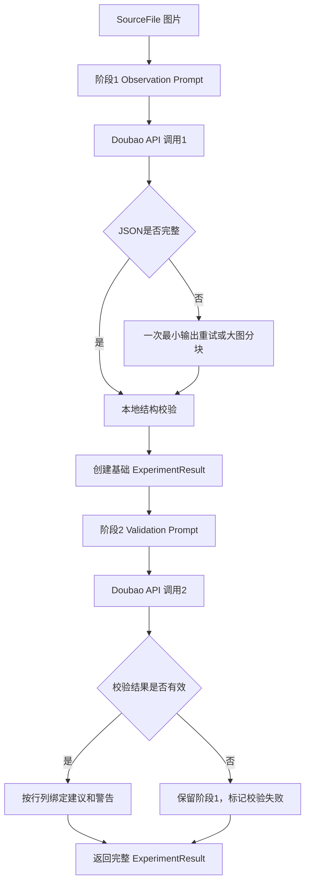

# AI Scientific Data Assistant v0.2.1 两阶段架构设计

## 一、设计背景

当前单阶段科研 Prompt 同时要求模型完成：

- 图片表格结构识别
- 所有实验行抄录
- 重复关系判断
- 模糊字符定位
- AI建议生成
- 推测依据和置信度
- 警告信息

10张真实图片 benchmark 中有2张因 `finish_reason=length` 返回不完整 JSON。对这两张图片使用临时最小 Prompt 后：

- 两张均返回完整 JSON；
- `finish_reason` 均变为 `stop`；
- 数据行分别完整返回28行和22行；
- 输出字符数减少约44%～54%。

因此，v0.2.1建议把“观察”和“推理”分为两个阶段。

---

## 二、设计目标

```text
阶段1：
科研图片
→ 结构化实验观察数据

阶段2：
原图 + 阶段1观察数据
→ AI校验、建议和异常分析

最后：
阶段1结果 + 阶段2结果
→ ExperimentResult
→ 人工确认
→ Excel
```

最高优先级：

1. 阶段1必须优先完整保存图片直接可见的数据行。
2. 阶段2不得修改或删除阶段1的观察数据。
3. AI建议只能作为候选，不能自动成为最终值。
4. 阶段2失败时，阶段1结果仍然可查看和人工编辑。

---

## 三、当前 ExperimentResult 是否支持

### 3.1 已经支持的部分

当前数据结构已经具备两阶段架构的大部分基础。

#### `SourceFile`

```python
SourceFile(
    filename,
    file_type,
    content,
)
```

能够保存原始图片信息和内存中的图片 bytes。两个阶段可以使用同一原图，不需要永久保存图片。

#### `ColumnInfo`

已有字段：

- `internal_name`
- `display_name`
- `unit`
- `confirmed`
- `source`
- `original_unit`
- `suggested_unit`
- `final_unit`

它已经能够区分：

```text
图片直接观察单位
→ AI建议单位
→ 用户最终确认单位
```

字段级单位确认不需要重新设计。

#### `DataRow`

已有字段：

- `values`
- `field_sources`
- `observed_values`
- `replicate_group`
- `replicate_index`
- `include_in_final`

它已经能够保存：

- `observed_values`：阶段1的图片直接观察值；
- `values`：当前或最终确认值；
- `field_sources`：最终值来自原始观察、AI建议或用户修改；
- 重复实验关系；
- 是否纳入最终结果。

#### `ExperimentResult`

已有字段：

- `rows`
- `ai_suggested_rows`
- `uncertain_items`
- `warnings`
- `provider`
- `user_confirmed`
- `modification_records`
- `model_response_logs`

可以分别容纳：

- 阶段1观察数据；
- 阶段2建议；
- 不确定项；
- 用户确认记录；
- 两次模型响应日志。

### 3.2 当前不足

#### `UncertainItem` 仍是非结构化文本

当前只有：

```python
UncertainItem(
    location,
    content,
    reason,
)
```

`observed_value`、`suggested_value`、字段名和置信度被拼接在 `content` 字符串中。页面需要再次解析字符串才能定位单元格。

这对当前MVP可以工作，但不适合稳定的两阶段合并。

#### `ai_suggested_rows` 语义不够明确

它可以保存一份应用建议后的完整表格，但存在两个问题：

1. 为了一个单元格建议而复制整行或整张表，容易产生重复数据。
2. 无法直接表达“这一项建议尚未经过用户确认”。

#### 缺少明确阶段状态

当前无法直接判断：

- 阶段1是否完成；
- 阶段2是否完成；
- 阶段2是否失败但阶段1可用；
- 当前结果是否由降级流程产生。

这些信息目前只能从 `warnings` 或 `model_response_logs` 推断。

### 3.3 总体判断

当前 `ExperimentResult` **可以承载两阶段MVP**，不需要为了开始实验而立即重构。

建议分两步：

1. v0.2.1首个实现先复用现有字段，验证10张图片成功率。
2. 验证稳定后，再增加少量可选字段，提高定位和追溯可靠性。

---

## 四、建议新增字段

以下是正式实现时的建议，本设计阶段不修改数据结构。

### 4.1 `UncertainItem` 建议增加可选结构化字段

```python
row_index: int | None = None
column_name: str | None = None
target_type: str = "cell"
observed_value: Any = None
suggested_value: Any = None
basis: str = ""
confidence: str = "low"
```

保留原有：

- `location`
- `content`
- `reason`

作为向后兼容字段。

收益：

- 阶段2结果可以直接绑定阶段1单元格；
- 页面不再从自然语言或 `content` 中猜测行列；
- Excel可以直接输出原始值、建议值和置信度；
- 不改变现有人工确认原则。

### 4.2 `ExperimentResult` 建议增加阶段状态

可以增加一个简单可选字段：

```python
pipeline_status: dict[str, Any] = {
    "observation_completed": False,
    "validation_completed": False,
    "validation_failed": False
}
```

或者使用更明确的数据类。MVP阶段使用字典更轻量。

作用：

- 阶段2失败时，页面可明确显示“观察数据可用，AI校验未完成”；
- 测试可以分别统计两个阶段成功率；
- 不需要从警告文字推断状态。

### 4.3 是否需要 `suggested_values`

有两种方案。

#### 方案A：继续使用 `ai_suggested_rows`

优点：

- 不新增字段；
- 对现有页面兼容性最好。

缺点：

- 需要复制完整行；
- 一个建议可能隐含覆盖其他字段的风险。

#### 方案B：在 `DataRow` 增加

```python
suggested_values: dict[str, Any] = {}
```

优点：

- 只保存真正有建议的字段；
- 与 `observed_values` 和 `values` 对称；
- 更容易保证建议不会覆盖最终值。

建议：

- v0.2.1初版先使用结构化 `UncertainItem.suggested_value`。
- 暂不新增 `DataRow.suggested_values`。
- 如果以后需要在整张表中同时展示大量建议，再评估增加。

### 4.4 不建议新增的字段

不建议在模型阶段加入：

- `final_value`
- `final_rows`
- `user_decision`

这些属于用户确认阶段，不应由AI生成。

---

## 五、Prompt拆分设计

## 5.1 阶段1：观察数据 Prompt

建议文件：

```text
prompts/scientific_observation_prompt.py
```

### 职责

只负责：

1. 判断列结构。
2. 识别所有图片可见实验行。
3. 保存图片直接可见字段值。
4. 保存明确可判断的重复关系。
5. 对无法辨认位置保留 `null`、`?` 或 `[模糊字符]`。
6. 返回简短结构警告。

### 输出

```json
{
  "columns": [
    {
      "internal_name": "treatment_id",
      "display_name": "处理编号",
      "original_unit": null
    }
  ],
  "observed_rows": [
    {
      "treatment_id": "S2/[模糊字符]/E+/N3",
      "measurement_1": "0.0?",
      "replicate_group": "S2/[模糊字符]/E+/N3",
      "replicate_index": 1
    }
  ],
  "warnings": [
    "存在模糊字符"
  ]
}
```

### 禁止输出

- `uncertain_items`
- `suggested_value`
- `basis`
- `confidence`
- `suggested_unit`
- `final_unit`
- `raw_text`
- 推理过程
- 解释文字

### 阶段1成功标准

- JSON完整闭合；
- `finish_reason=stop`；
- 图片中所有可见数据行都存在；
- 处理编号和测量值没有因为推理被改写；
- 不要求所有字符都确定。

## 5.2 阶段2：校验与建议 Prompt

建议由当前：

```text
prompts/scientific_data_validation_prompt.py
```

演进为明确的第二阶段 Prompt。

### 输入

- 原始图片；
- 阶段1的紧凑 `columns`；
- 阶段1的 `observed_rows`。

### 职责

1. 检查阶段1是否漏行。
2. 检查字段是否错位。
3. 检查处理编号、数字、单位和符号异常。
4. 检查实验设计规律。
5. 生成 `suggested_value`。
6. 生成简短 `basis`。
7. 生成 `confidence`。
8. 生成字段单位建议。

### 输出

```json
{
  "additional_uncertain_items": [
    {
      "row_index": 5,
      "column_name": "treatment_id",
      "target_type": "cell",
      "observed_value": "S2/AH/E+/N3",
      "suggested_value": "S2/H/E+/N3",
      "basis": "同列该变量仅出现L或H",
      "confidence": "low"
    }
  ],
  "column_suggestions": [
    {
      "column_name": "measurement_1",
      "suggested_display_name": null,
      "suggested_unit": "mg"
    }
  ],
  "warnings": [
    "第5行处理编号需要人工确认"
  ]
}
```

### 阶段2禁止输出

- 完整 `observed_rows` 副本；
- 最终确认数据；
- 自动修改后的正式表格；
- `content` 与 `reason` 等可由程序生成的重复字段；
- 长篇推理过程。

### 阶段2安全规则

- `row_index + column_name` 必须指向阶段1已有单元格；
- `observed_value` 必须与阶段1值一致；
- 不一致时拒绝自动绑定，并加入warning；
- `suggested_value` 只能进入待确认建议；
- 阶段2不得改变行数。

---

## 六、Provider调用流程调整

## 6.1 建议的主流程



## 6.2 `VisionProvider` 接口

当前接口：

```python
process_images(images, experiment_context=None) -> ExperimentResult
```

建议保持不变。

两阶段编排属于 `DoubaoProvider` 的内部实现：

```text
VisionProvider调用者
→ DoubaoProvider.process_images()
→ provider内部阶段1
→ provider内部阶段2
→ 返回一个ExperimentResult
```

这样：

- Streamlit无需知道内部调用了几次模型；
- MockProvider仍可一次返回完整模拟结果；
- 未来OpenAI、Claude或Gemini Provider可以使用同一两阶段原则；
- 不破坏平台无关核心接口。

## 6.3 阶段1解析

阶段1成功后立即：

1. `json.loads()`；
2. 检查顶层只有预期字段；
3. 检查 `columns` 和 `observed_rows` 为列表；
4. 检查每列有 `internal_name`；
5. 创建 `ColumnInfo` 和 `DataRow`；
6. 将阶段1值同时写入：
   - `DataRow.observed_values`
   - 初始 `DataRow.values`
7. 初始来源设为 `original`。

## 6.4 阶段2合并

阶段2返回后：

1. 检查 `row_index` 是否在阶段1行数范围内；
2. 检查 `column_name` 是否存在；
3. 检查返回的 `observed_value` 是否等于阶段1值；
4. 创建结构化 `UncertainItem`；
5. 生成兼容旧页面的 `content` 和 `reason`；
6. 将建议写入 `ai_suggested_rows` 或待确认项；
7. 不修改 `result.rows` 的原始值。

## 6.5 失败与降级

### 阶段1失败

阶段1是核心，不可跳过。

处理顺序：

1. 判断 `finish_reason`；
2. JSON失败时最多重试一次；
3. 重试必须使用最小输出，不可重复复杂输出；
4. 大图仍失败时使用分块；
5. 全部失败后向用户报告，不能生成伪数据。

### 阶段2失败

阶段2不是原始数据的唯一来源。

处理方式：

- 返回阶段1 `ExperimentResult`；
- `uncertain_items` 可以为空；
- 增加“AI校验未完成，请人工检查”的warning；
- 标记 `validation_failed=True`；
- 用户仍可编辑阶段1数据；
- 不自动声称数据已最终确认。

## 6.6 日志与性能

`model_response_logs` 应分别记录：

- `stage=observation`
- `stage=validation`
- response id
- finish reason
- token usage
- 输出长度
- API耗时
- 是否发生重试

禁止记录：

- API Key
- 用户密钥配置

---

## 七、人工确认数据流

```text
阶段1 observed_value
        ↓
阶段2 suggested_value
        ↓
用户操作：
  采用AI建议 / 保留原始 / 手动修改
        ↓
final value 写入 DataRow.values
        ↓
field_sources 记录来源
```

来源建议统一为：

- `original`：用户保留阶段1观察值；
- `ai_suggestion`：用户主动接受阶段2建议；
- `user_modified`：用户手动输入；
- `user_added`：用户新增数据。

AI建议永远不能自动修改 `DataRow.values`。

---

## 八、Excel三个工作表设计

继续保留现有三个工作表：

1. `整理后数据`
2. `字段说明`
3. `识别记录`

## 8.1 工作表1：整理后数据

用途：

只保存用户最终确认并纳入结果的数据。

数据来源：

- `DataRow.values`
- 只输出 `include_in_final=True` 的行

建议结构：

| 序号 | 处理编号 | 测量值1 | 测量值2 |
|---:|---|---:|---:|
| 1 | S2/H/E+/N3 | 0.079 | 4.58 |

规则：

- 不输出AI未确认建议；
- 不覆盖阶段1历史；
- 序号按有效行连续生成；
- 单个字段为空不等于整行无效。

## 8.2 工作表2：字段说明

用途：

区分字段和单位的三个阶段。

建议结构：

| 字段内部名称 | 原始字段名称 | AI建议名称 | 最终字段名称 | 原始单位 | AI建议单位 | 最终单位 | 最终来源 |
|---|---|---|---|---|---|---|---|
| measurement_1 | 测量值1 | Na含量 | Na含量 | null | mg | mg | AI建议经用户确认 |

当前 `ColumnInfo` 已支持：

- `original_unit`
- `suggested_unit`
- `final_unit`

如果以后需要严格追踪字段名称三层关系，可再增加：

- `original_display_name`
- `suggested_display_name`
- `final_display_name`

MVP阶段也可以继续使用现有 `display_name + source + confirmed`。

## 8.3 工作表3：识别记录

用途：

完整追踪：

```text
阶段1原始观察
→ 阶段2AI建议
→ 用户最终确认
```

不建议继续只在一个单元格内保存整张表的字符串表示。建议未来按“单元格/字段确认记录”逐行输出：

| 文件名 | 数据行 | 字段 | 原始观察值 | AI建议值 | 推测依据 | 置信度 | 最终确认值 | 最终来源 | 是否纳入结果 |
|---|---:|---|---|---|---|---|---|---|---|
| image.jpg | 5 | treatment_id | S2/AH/E+/N3 | S2/H/E+/N3 | 同列变量规律 | low | S2/H/E+/N3 | AI建议经用户确认 | 是 |

还应保存字段级单位记录：

| 文件名 | 类型 | 字段 | 原始单位 | AI建议单位 | 最终单位 | 最终来源 |
|---|---|---|---|---|---|---|
| image.jpg | 单位 | measurement_1 | null | mg | mg | AI建议经用户确认 |

这样三个工作表的职责清晰：

```text
整理后数据：用户最终要分析的数据
字段说明：字段与单位定义
识别记录：原始观察、AI建议和用户决定的审计轨迹
```

---

## 九、v0.2.1建议实施顺序

### 第一步：保留现有数据模型做最小实现

先验证架构，不立即新增字段：

- 阶段1生成 `columns` 和 `rows`；
- 阶段2生成现有 `UncertainItem`；
- 使用 `content` 兼容现有页面；
- 继续使用 `model_response_logs`。

用原10张图片测试：

- 阶段1成功率；
- 阶段2成功率；
- 总成功率；
- 行数完整性；
- token和耗时。

### 第二步：结构化 UncertainItem

验证两阶段稳定后，增加可选定位字段：

- row index
- column name
- observed value
- suggested value
- basis
- confidence

同步减少页面字符串解析逻辑。

### 第三步：Excel审计记录升级

将“识别记录”从单行大字符串改为逐单元格追踪记录，但保持工作表数量和主要数据表不变。

---

## 十、验收标准

### 稳定性

- 原10张图片阶段1 JSON成功率目标：10/10。
- 不再因详细不确定项导致阶段1 `finish_reason=length`。
- 阶段2失败不丢失阶段1数据。

### 数据完整性

- 阶段1行数不得低于图片人工确认的实验记录行数。
- 阶段2不得改变阶段1行数。
- 每条建议必须绑定有效行和字段。
- `observed_values` 在人工确认后仍保持不变。

### 性能

分别记录：

- 阶段1耗时；
- 阶段2耗时；
- 重试耗时；
- 总耗时；
- 两阶段token使用。

两阶段不一定立即提升总速度，但应先显著提高首轮数据完整率和失败可恢复性。

### Excel

- `整理后数据` 只使用最终确认值；
- `字段说明` 区分原始、建议和最终单位；
- `识别记录` 可追溯原始观察、AI建议、最终值和来源。

---

## 十一、最终建议

当前 `ExperimentResult` 已经具备两阶段架构的核心基础，不建议推倒重来。

v0.2.1推荐方案：

1. 保持 `VisionProvider.process_images()` 接口不变。
2. Provider内部执行两个阶段。
3. 阶段1只返回最小结构化观察数据。
4. 阶段2只返回定位明确的异常和建议。
5. 阶段2失败时仍返回阶段1结果。
6. 初版复用当前数据模型。
7. 稳定后优先把 `UncertainItem` 改为结构化定位，而不是增加更多顶层模型。
8. Excel继续使用三个工作表，但“识别记录”未来改为逐字段审计表。

该方案能保留当前MVP架构，同时直接针对已经验证的 JSON截断问题。
